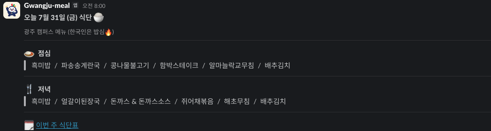
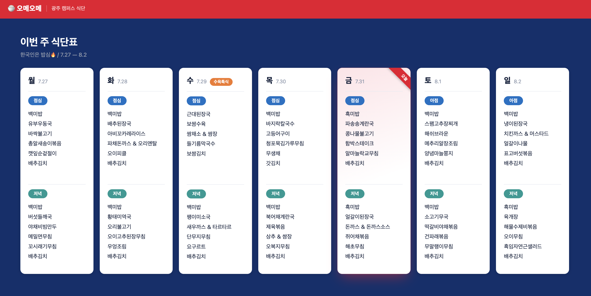
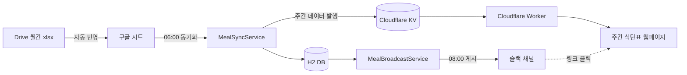
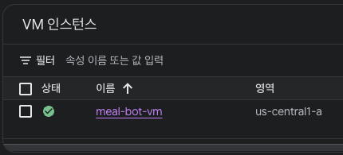
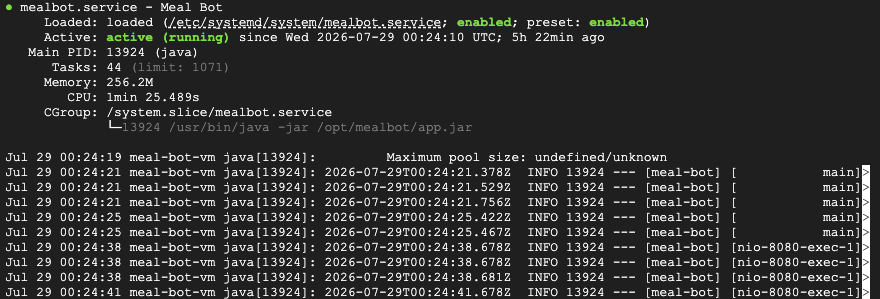
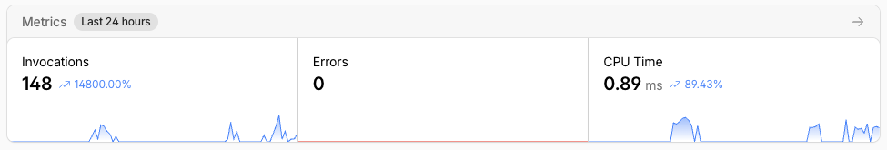

# meal_bot (오메오메)

SKALA 광주 캠퍼스 강의장 월간 식단표(구글 시트)를 매일 08시에 슬랙 채널에 자동으로 게시하고, 주간 식단표를 볼 수 있는 웹페이지를 제공하는 봇

## 데모

<!-- 캡처 추가: 슬랙에 게시된 오늘의 식단 메시지 -->


<!-- 캡처 추가: 주간 식단표 웹페이지 (Cloudflare Worker) -->


## 배경

매일 아침 그날 식단을 확인하려면 구글 시트를 직접 열어봐야 했고, 이를 다른 사람들에게 알리려면 화면을 캡처해 단체 채팅방에 올리는 과정을 매일 반복해야 했다. 사소하지만 매일 손이 가는 일이었고, 깜빡 잊고 늦게 올리는 일도 발생했다. 이러한 반복 작업을 없애기 위해 시트 → 슬랙 자동 게시를 만들게 되었다.

## 무엇을 하나

- 매일 08시, 그날 점심, 저녁 메뉴를 슬랙 채널에 자동으로 게시한다 (같은 날 중복 게시는 자동 차단).
- 메시지 안의 "🗓️ 이번 주 식단표" 링크를 누르면 이번 주 전체 식단표를 보여주는 웹페이지로 이동한다.

## 아키텍처 & 배포



두 개의 독립된 배포 단위가 Cloudflare KV 하나로만 연결되어 있고, 서로 직접 요청을 주고받지 않는다.

**Spring Boot 앱 — GCP Compute Engine (e2-micro, 상시 구동)**
- 매달 Drive에 새 월간 식단표(xlsx)가 올라오면 `DriveMealImportService`가 자동으로 감지해 구글 시트에 반영한다 (사람이 옮겨 적을 필요 없음).
- 06:00(KST) `MealSyncService`가 구글 시트를 읽어 DB에 동기화하고, 그 주 데이터를 Cloudflare KV에 발행한다.
- 08:00(KST) `MealBroadcastService`가 그날 점심, 저녁을 슬랙 채널에 게시한다 (`post_log` 테이블로 같은 날 중복 게시 차단).
- systemd 서비스로 등록되어 있어 로컬 컴퓨터를 꺼도 매일 자동으로 동작한다.

**Cloudflare Worker — 주간 식단표 웹페이지**
- 요청이 올 때마다 Cloudflare KV에 저장된 최신 주간 데이터를 읽어 정적 HTML로 렌더링한다.
- Worker가 Spring Boot 앱에 직접 요청하지 않는 단방향 구조라, 앱 쪽에 공개 API를 열거나 서명 검증을 추가할 필요가 없다.

| GCP VM 인스턴스 | systemd 서비스 상태 | Cloudflare Worker Metrics |
| :---: | :---: | :---: |
|  |  |  |

## 주요 기술적 의사결정 & 트레이드오프

**VM과 서버리스를 역할별로 분리**
DB와 스케줄러처럼 상태를 유지해야 하는 부분(시트 동기화, 슬랙 게시)은 GCP VM에, 데이터를 읽어 HTML만 그리면 되는 웹페이지는 Cloudflare Worker에 구현하였다. 관리해야 할 배포 단위가 두 개로 늘어나지만, 각 역할에 필요한 만큼만 리소스를 쓰게 되어 두 서비스 모두 무료 티어 안에서 운영할 수 있다.

**앱 → Worker 단방향 연결 (Cloudflare KV)**
Worker는 Spring Boot 앱에 직접 요청을 보내지 않고, 앱이 동기화 시점에 미리 채워둔 Cloudflare KV만 읽게하여, 앱 쪽에 공개 API 엔드포인트나 요청 서명 검증을 추가할 필요가 없다. 웹페이지 데이터는 실시간이 아니라 "가장 최근 동기화 시점" 기준으로 갱신되는 문제가 있지만, 이 프로젝트는 하루 단위로만 데이터가 바뀌므로 문제되지 않는다고 판단하였다.

**동기화(06:00)와 게시(08:00)를 분리**
시트를 읽어 DB/KV에 반영하는 작업과 슬랙에 게시하는 작업을 같은 코드에서 한 번에 처리하지 않고 별도 스케줄로 나눴다. 동기화가 실패해도 게시 로직에는 영향이 없고, 반대로 게시만 다시 시도해야 할 때 시트를 다시 읽을 필요가 없다.

**게시 멱등성 보장 (`post_log` 테이블)**
같은 날짜에 게시가 두 번 이상 트리거돼도(재배포 후 재시작, 수동 재시도 등) `post_log`에 이미 기록이 있으면 다시 게시하지 않는다.

**프레임워크 없이 HTML/CSS/JS로 웹페이지 구현**
렌더링할 화면이 주간 그리드 하나뿐인 규모에서는 프레임워크 도입이 오히려 배포 파이프라인(빌드 → 배포)만 늘리는 과한 선택이라 판단하였고, Worker는 빌드 단계 없는 단일 JS 모듈이라, React 같은 프레임워크 대신 템플릿 문자열로 HTML을 직접 그리는 방식을 선택하였다. 

**Drive 원본 파일을 구글 시트로 변환하지 않고 직접 파싱**
매달 올라오는 xlsx를 구글 시트로 변환해 읽으려 했으나(Drive `files.copy`), 서비스 계정은 자체 Drive 저장 용량이 0이라 새 파일을 만드는 시점에 `storageQuotaExceeded` 오류가 발생하였다. 대신 xlsx를 바이트로 직접 내려받아 Apache POI로 셀 값을 읽는 방식으로 바꿔, 파일 생성 자체를 없애 이 제약을 우회하였다.

**파일 ID가 아닌 파일명 기준으로 반영 여부 판단**
처음에는 Drive 파일 ID로만 "이미 반영했는지"를 판단했는데, 담당자가 파일을 삭제 후 같은 이름으로 재업로드하면 새 ID로 인식되어 이전 내용이 지워지지 않은 채 중복으로 반영되었다. 파일명을 키로 이전 반영 기록을 찾고, 그 파일이 시트에 남긴 범위를 저장해뒀다가 교체 시 먼저 지우는 방식으로 바꿔 해결하였다.

## 어려웠던 점 / 배운 것

**구글 시트 파싱 — 정형화되지 않은 데이터 다루기**
- 시트는 값이 일정한 위치에 있지 않고, 병합된 셀이나 빈 칸이 이어지는 형태가 많아서 "빈 칸이면 바로 위 셀의 값을 이어받는" forward-fill 로직이 필요했고 연도도 시트에 없어서 별도 설정값으로 보완했다.

**배포 과정에서 만난 구체적인 에러들**
- GCP 예산 알림을 `--budget-amount=1USD`로 생성하려다 실패하였다. 빌링 계정의 통화가 KRW였던 것이 원인이었고, `gcloud billing accounts describe`로 계정 정보를 조회하여 확인하였다.

- Spring Boot fat jar 안의 H2 데이터베이스 도구를 VM에서 실행해야 했는데, VM에는 JRE만 설치되어 있어 `jar`/`unzip` 명령이 없음을 확인하여, Python `zipfile` 모듈로 jar 안의 클래스를 직접 꺼내는 방식으로 우회하였다.
- Drive API로 xlsx를 구글 시트로 변환해 읽으려 했으나, 서비스 계정 자체의 Drive 저장 용량이 0이라 변환 사본을 만드는 시점에 `storageQuotaExceeded`가 발생하였다. xlsx를 바이트로 직접 받아 Apache POI로 파싱하는 방식으로 바꿔 해결하였다.
- 실제 운영 중 담당자가 8월 파일을 삭제 후 같은 이름으로 재업로드했는데, 파일 ID 기준 추적 로직이 이를 새 파일로 인식해 8월 데이터가 시트에 중복으로 반영되었다. 파일명 기준으로 이전 파일을 찾아 그 파일이 남긴 범위를 지우고 교체하도록 바꿔 해결하였다.

**주간 그리드 UI를 다듬는 과정**
- 요일 수가 5~7일로 유동적인 주(공휴일 등으로 데이터가 없는 날이 있음)에도 그리드가 깨지지 않도록 반응형 레이아웃으로 맞췄다.

**배포 접근 방식**
1. 무엇이 상시 필요하고 무엇이 상태를 가지는지부터 정하고, 플랫폼 선택은 그 다음 순서로 진행하였다.
2. 벤더별 기능을 외우기보다 "상시 구동 vs 요청 단위 실행", "직접 관리 vs 관리형", "상태 저장 가능 여부", "비용 구조" 같은 트레이드오프의 축으로 판단하였다.
3. 기능을 바꿀 때마다 실제 슬랙 채널에 재게시하여 결과를 확인하였고, 반복 검증을 위해 오늘자 게시 기록을 지우고 서비스를 재시작하는 절차를 만들었다. 또한, 재부팅 후 자동 복구도 VM을 직접 재부팅시켜 검증하였다.

## 기술 스택

**Backend**


**Integration**


**Frontend**


**Edge / Web**


**Infra**


## 실행 방법

### 필요한 것
- 구글 서비스 계정 인증서(`credentials.json`)와 식단표가 있는 구글 시트 ID
- 슬랙 앱 Bot Token, Signing Secret, 게시할 채널 ID
- (선택) Cloudflare 계정, API 토큰, KV 네임스페이스 — 주간 웹페이지를 발행할 때만 필요
- (선택) 월간 식단표 xlsx가 올라오는 Drive 폴더 ID + 서비스 계정에 폴더 뷰어·시트 편집자 권한 — 시트 자동 반영 기능에만 필요

### 환경변수
`.env` 또는 실행 환경에 설정한다.
```
SLACK_BOT_TOKEN=xoxb-...
SLACK_SIGNING_SECRET=...
SLACK_CHANNEL_ID=...
GOOGLE_CREDENTIALS_PATH=./secrets/credentials.json
GOOGLE_SPREADSHEET_ID=...
MEAL_YEAR=2026
MEAL_SITE_URL=            # Cloudflare Worker 배포 URL, 비워두면 슬랙 메시지에 링크를 생략한다
CLOUDFLARE_ENABLED=false  # true로 켜면 동기화 시점에 KV로 주간 데이터를 발행한다
DRIVE_FOLDER_ID=          # 월간 식단표 xlsx가 올라오는 Drive 폴더 ID, 비워두면 자동 반영을 건너뛴다
```

### Spring Boot 앱
```bash
./gradlew test      # 테스트
./gradlew bootRun   # 로컬 실행 (localhost:8080)
```
스케줄 시간을 기다리지 않고 즉시 확인하려면:
```bash
curl -X POST localhost:8080/admin/import-drive                 # Drive의 새 xlsx를 게시용 시트에 반영
curl -X POST localhost:8080/admin/sync                        # 시트 → DB 동기화
curl "localhost:8080/admin/meals?date=2026-07-29"              # 특정 날짜 조회
curl -X POST "localhost:8080/admin/broadcast?date=2026-07-29"  # 슬랙 게시
curl "localhost:8080/admin/week?date=2026-07-29"                # 웹페이지용 주간 payload 확인
```

### Cloudflare Worker
```bash
cd worker
npx wrangler dev     # 로컬 구동
npx wrangler deploy  # 실제 배포
```

## 앞으로 할 일

- **배포 자동화 (CI/CD)** — 지금은 jar를 빌드해 VM에 수동으로 올리고 systemd를 재시작하는 방식이지만, GitHub Actions 등으로 빌드와 배포를 자동화할 개선점이 있다.
- **다른 캠퍼스로 확장** — 현재는 광주 캠퍼스 하나만 지원하지만 캠퍼스별(판교, 울산) 시트/채널을 설정으로 분리하면 다른 캠퍼스에도 적용할 수 있다.
